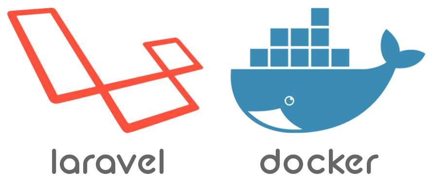

# Laravel-Docker-Template

<p align="center"></p>


## About This 
I built it to work with Laravel and Docker very easily. Here you can work with any version of Laravel, just change the php version from php/Dockerfile. It can be used to create a new Laravel project by using docker and also dockerize the existing project. Since composer will always be updated here, when creating a new project, the latest version of Laravel will be installed. I'm new to Docker, so there might be some mistakes here. I will try to fix the mistakes. 

</br> 

## Quick Guide
Just Put your Project in <b>src</b> Folder and change <b>.env</b>, <b>docker-compose.yml</b> and <b>Dockerfile</b> as you need. Granting <b>'src'</b> folder and <b>'artisan'</b> file permissions. Working with your database. 

Now run these commands: 
```
docker-compose up -d 
docker-compose -f docker-compose.next.yml up -d 

```

⚠️ Don't forget to rename these files for security purpose:
```
Dotdockerignore
Dotgitignore
```
Enter . instead of Dot. Such as .dockerignore, .gitignore. 

</br>

--- 

## For existing laravel project 
After download from GitHub: 

1. (Essential) Change the php version from 'php/Dockerfile' according to the work convenience. 

```
FROM php:8-fpm-buster
or, 
FROM php:7.4.16-fpm-buster
or, 
another image of php. 
```

2. Move everything from your laravel project folder and put them directly in the src folder . Now looks like - 
```
src/app
src/routes
src/vendor
src/.env 
... 
```


3. Granting 'src' folder permissions. From the root folder type - 

(Linux command) 

```
sudo chmod -R 777 src 
```


4. Give permission to 'artisan' file (src/artisan): 
(from root folder) 
cd src

(Linux command) 

```
sudo chmod -R 775 artisan
```

Now go back to the root folder: 

``
cd .. 
``


5. The data of the '.env' file and the 'docker-compose.next.yml' file should be matched. But if you use 'sqlite' instead of 'MySQL' or 'MariaDB' or any other database server, then do nothing. 


6. Creating all images: 
```
docker-compose up -d 
docker-compose -f docker-compose.next.yml up -d 
```


7. The following files should be renamed so that there is no problem when pushing to Docker system and GitHub. 

```
Dotdockerignore
Dotgitignore
```

Enter . instead of Dot. Such as: 

```
.dockerignore
.gitignore
```


8. Run these commands (if your laravel project has everything such as vendor folder and the project is perfect, then skip this step): 
```
docker-compose -f docker-compose.next.yml run --rm composer update
docker-compose -f docker-compose.next.yml run --rm npm install
docker-compose -f docker-compose.next.yml run --rm npm run dev
```

Key Generating: 
```
docker-compose -f docker-compose.next.yml run --rm artisan key:gen
or,
docker-compose -f docker-compose.next.yml run --rm artisan key:generate 
```

</br>

#### Database Migration or Import Database (if need): 
(After creating migration files) 
Migrate Database - 

```
docker-compose -f docker-compose.next.yml run --rm artisan migrate 
```

</br> 

(If you have database file) 
Import Database - 

```
http://localhost:8077/  -> Login -> select your database 'laraveldb' -> Import -> Choose Files -> Select your database from Computer -> click Execute. 
```

9. Run the project (see port of nginx service from docker-compose.next.yml file):

```
http://localhost:8085/
```

---

## For creating new laravel project 
After download from GitHub: 

1. Change the php version from <b>'php/Dockerfile'</b> according to the work convenience. 

```
FROM php:8-fpm-buster
or, 
FROM php:7.4.16-fpm-buster
or, 
another image of php. 
```

2. Granting 'src' folder permissions. From the root folder type - 

(Linux command) 

```
sudo chmod -R 777 src
```


3. For creating a new laravel project - 

```
docker-compose up -d         
docker-compose run composer create-project laravel/laravel myprolaravel
```


4. Open <b>'myprolaravel'</b> folder from <b>'src'</b> and then putting everything in the <b>'src'</b> folder of <b>'myprolaravel'</b> folder. Now your <b>'myprolaravel'</b> folder is empty, so remove that folder before check. Now looks like - 

```
src/app
src/routes
src/vendor
src/.env 
... 
```

5. Creating all images: 

```
docker-compose -f docker-compose.next.yml up -d
```


6. Give permission to 'artisan' file (src/artisan): 

```
cd src
sudo chmod -R 775 artisan
cd .. 
```

7. The data of the <b>'.env'</b> file and the <b>'docker-compose.next.yml'</b> file should be matched. 


8. The following files should be renamed so that there is no problem when pushing to Docker system and GitHub. 

```
Dotdockerignore
Dotgitignore
```

<b>Enter . instead of Dot. Such as:</b>
.dockerignore
.gitignore


</br> 

9. Database Migration or Import Database: 

(After creating migration files) 
Migrate Database - 

```
docker-compose -f docker-compose.next.yml run --rm artisan migrate 
```

(If you have database file) 
Import Database - 
```
http://localhost:8077/  -> Login -> select your database 'laraveldb' -> Import -> Choose Files -> Select your database from Computer -> click Execute. 
```

10. Run the project (see port of nginx from docker-compose.next.yml file):

```
http://localhost:8085/

```

---

### You can see the vertion of php and laravel: 

```
docker-compose -f docker-compose.next.yml run php -v
docker-compose -f docker-compose.next.yml run artisan --version
```

### check your user id and change it from docker-compose.next.yml file. 
```
user: "1000:1000" 
```

### If you see this error: 
Fatal error: Composer detected issues in your platform: Your Composer dependencies require a PHP version ">= 8.1.0". You are running 7.4.16. in /var/www/html/vendor/composer/platform_check.php on line 24

```
(Need VS Code with Docker extension)

Stop and remove all running container -> Remove image of this project from Images section -> Change the image of Php from 'php/Dockerfile' -> Now run these commands: 
docker-compose up -d         
docker-compose -f docker-compose.next.yml up -d
```


### You can see the vertion of php and laravel: 

```
docker-compose -f docker-compose.next.yml run php -v
docker-compose -f docker-compose.next.yml run artisan --version
```

### check your user id and change it from docker-compose.next.yml file. 

```
user: "1000:1000" 
```

---

</br> 

## License
<a href="https://packagist.org/packages/laravel/framework"></a>
</br>
The Laravel framework is open-sourced software licensed under the [MIT license](http://opensource.org/licenses/MIT).
